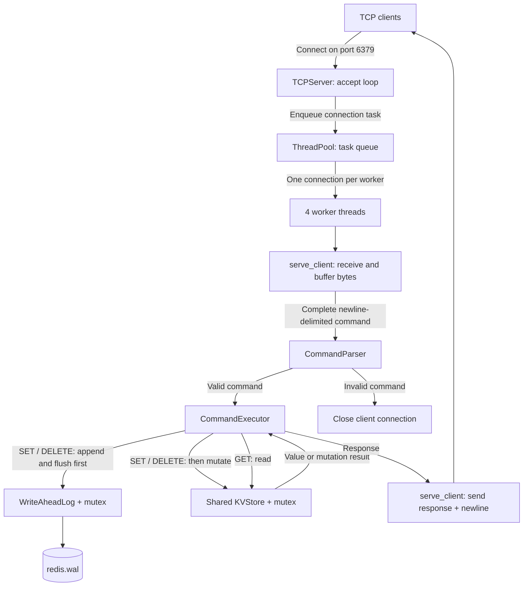

A concurrent key-value server in C++17, built with POSIX sockets, a custom
thread pool, a synchronized in-memory store, and an append-only write-ahead log.
The server implements connection handling, command parsing, worker scheduling,
and mutation logging without external runtime libraries.

The server accepts newline-delimited commands and returns one newline-delimited
response for each valid command.

## Performance snapshot

Measured **13.3K GET operations/sec** with one client, with **66 µs p50** and
**170 µs p99** round-trip latency. Results are medians of three runs of 50,000
commands using a C++ Release build on localhost under WSL2. The WAL used a
memory-backed filesystem. See [Benchmarks](#benchmarks) for all four workloads,
machine details, and reproduction commands.

## Engineering overview



The arrows show command flow. Logging and store mutations have separate locks;
the diagram does not imply one atomic operation across both components.

| Component | Responsibility |
| --- | --- |
| `TCPServer` | Accepts connections on port 6379 and dispatches them to four workers |
| `ThreadPool` | Queues tasks, wakes workers with a condition variable, and joins them at destruction |
| `CommandParser` | Validates command names and argument counts |
| `CommandExecutor` | Logs mutations and applies commands to the shared store |
| `KVStore` | Protects an `unordered_map` with a mutex |
| `WriteAheadLog` | Appends SET and DELETE records to a file under a mutex |

The server owns the store, log, and worker pool. Each connection creates an
executor that borrows the store and log by reference. The pool is declared last
so its workers join before those shared resources are destroyed.

Each worker handles one connection until it disconnects. Four idle clients can
therefore occupy all four workers while additional connections wait in the task
queue. Commands split across socket reads are buffered until a newline arrives.

## Supported commands

- `SET <key> <value>` stores a value and returns `OK`.
- `GET <key>` returns the value. It returns `(nil)` if the key does not exist.
- `DELETE <key>` removes a key. It returns `1` if the key existed and `0` if it
  did not exist.
- `EXIT` returns an empty response line. It does not close the connection.

Keys and values cannot contain spaces. An invalid command closes the client
connection.

SET and DELETE append records to `redis.wal` in the server's working directory.
The log opens in append mode and flushes after each record. Startup does not
replay the log, so restarting the server leaves the in-memory store empty.

## Requirements

You need the following software:

- A C++17 compiler
- CMake 3.16 or newer
- Linux, macOS, or WSL

The TCP server and its integration tests use POSIX sockets, so they do not build
natively on Windows.

## Build the project

Run these commands from the repository root:

```sh
cmake -S . -B build
cmake --build build
```

## Run the server

Start the server after the build completes:

```sh
./build/server
```

Open another terminal and connect with Netcat:

```sh
nc 127.0.0.1 6379
```

Enter one command per line:

```text
SET account active
GET account
DELETE account
GET account
```

The server responds with:

```text
OK
active
1
(nil)
```

Open more Netcat sessions to use the server from several clients at the same
time. Each session accesses the same in-memory store.

## Run the tests

Build and run all tests with CTest:

```sh
cmake -S . -B build
cmake --build build
ctest --test-dir build --output-on-failure
```

The test suite covers command parsing, command execution, store operations,
thread-pool shutdown, fragmented TCP messages, batched commands, and concurrent
clients.

WAL tests verify exact record contents, append behavior after reopening, invalid
paths, and 200 concurrent writes with no missing or duplicate records. Executor
tests check that reads and EXIT do not write records.

Socket tests exercise eight simultaneous handlers, shared data across client
connections, mutation logging, and invalid or incomplete commands. These tests
use Unix socket pairs and call `serve_client` directly. They do not exercise
the TCP listener or its thread-pool dispatch.

Tests create isolated temporary log directories and remove them afterward.
CTest limits each test executable to 30 seconds to catch hangs.

Run either test executable directly when you need its full output:

```sh
./build/redis_kv_tests
./build/tcp_server_tests
```

## Benchmarks

Measured on localhost in WSL2 with a Release build. Each row reports the
median throughput, median p50, and median p99 from three runs of 50,000 total
commands. Latency is round-trip time per command.

| Workload | Clients | Ops/s | p50 (µs) | p99 (µs) |
| --- | ---: | ---: | ---: | ---: |
| GET | 1 | 13,311 | 66.0 | 169.7 |
| SET | 1 | 13,029 | 68.4 | 168.2 |
| GET | 4 | 10,533 | 356.0 | 951.9 |
| SET | 4 | 10,755 | 348.7 | 936.6 |

Environment: Intel Core i7-10870H, 8 cores and 16 logical CPUs exposed to WSL2;
Linux 6.18.33.2-microsoft-standard-WSL2; GCC 15.2.0; Python 3.14.4.
CMake Release used `-O3 -DNDEBUG` and C++17.
WAL files were under `/tmp/kv-bench-*/redis.wal` on **tmpfs**, a memory-backed
filesystem. These results do not measure physical disk performance.

To reproduce from a Linux or WSL terminal:

```sh
cmake -S . -B cmake-build-release -DCMAKE_BUILD_TYPE=Release
cmake --build cmake-build-release -j2
python3 tools/bench.py --server cmake-build-release/server
```

The script starts and stops its own server. Port 6379 must be free.
For a quick check, add `--ops 100 --repeats 1`.

The benchmark uses only Python's standard library. Each client connects, sends
1,000 warmup commands, waits for the other clients, then measures its commands.
Each request waits for a complete response before the next request starts.
Clients cycle through 100 prepopulated keys using a fixed value.
The 50,000 measured commands are split equally among clients.

Every response is checked. Throughput is successful commands divided by the
time from the shared start to the last response. Latency uses a monotonic
nanosecond clock; p50 and p99 use nearest-rank percentiles across all clients.
Setup and warmup are excluded. Each run uses a fresh server and temporary WAL
directory, which is removed afterward.

Single-client GET was slightly faster than SET. Four-client SET was slightly
faster than GET, and neither four-client scenario improved throughput over one
client. These are end-to-end measurements that include Python thread scheduling,
socket operations, parsing, and server work; they do not isolate the bottleneck
or establish maximum server throughput.

WAL flushing stays enabled, but stream flush is not `fsync`, and startup recovery
is not implemented. These numbers are not a Redis comparison: the protocol and
durability guarantees differ.

## Add a test

Unit tests live in `tests/tests.cpp`. TCP integration tests live in
`tests/tcp_server_tests.cpp`. Each file has a small test runner with no external
test-framework dependency.

Create a test function that calls `require` for each expected result. Register
the function in the `tests` list in `main`:

```cpp
void test_example() {
    KVStore store;
    store.set("key", "value");

    require(store.get("key") == std::optional<std::string>{"value"},
            "GET should return the stored value");
}
```

## Current limits and next steps

The current implementation has the following limits:

- The protocol is plain text and is not compatible with Redis RESP.
- The WAL has no replay or recovery implementation. Stream flushes do not
  guarantee durability after power loss.
- The log and store use separate mutexes. Concurrent mutation order in the log
  can differ from mutation order in memory.
- Socket error handling, partial sends, graceful shutdown, and write-failure
  reporting need further work.
- The server binds to all IPv4 interfaces and has no authentication or TLS.
- Expiration, bounded queues, and server-side connection timeouts are not implemented.

The next persistence milestone is to serialize each log-and-store mutation,
handle failed writes, and replay validated records at startup. End-to-end
listener correctness tests and benchmarks on a disk-backed WAL would then extend
the current coverage.
